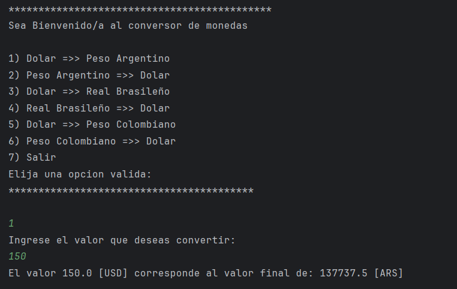

# Conversor de Monedas
<h3>Descripción</h3>

Este es un programa simple de conversión de monedas escrito en Java. Utiliza la API de ExchangeRate para obtener las últimas tasas de cambio y convertir montos entre varias monedas. El programa está diseñado para ejecutarse desde la línea de comandos y proporciona una interfaz de menú para que los usuarios seleccionen diferentes opciones de conversión.
********************************************
<h3>Características</h3>

- Convierte montos entre USD y ARS (Peso Argentino)
- Convierte montos entre USD y BRL (Real Brasileño)
- Convierte montos entre USD y COP (Peso Colombiano)
- Interfaz de menú simple y fácil de usar

<h3>Prerrequisitos</h3>

- Java 11 o superior
- Conexión a internet activa para obtener las últimas tasas de cambio
- Clave de API de ExchangeRate

********************************************

<h3>Ejemplo de Salida</h3>

